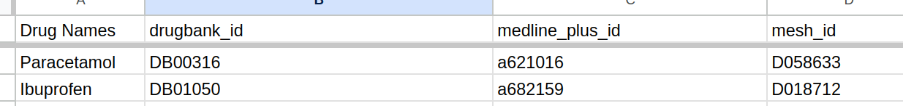

<a href="https://fastdatascience.com"><span align="left">🌐 fastdatascience.com</span></a>
<a href="https://www.linkedin.com/company/fastdatascience/"></a>
<a href="https://twitter.com/fastdatascienc1"></a>
<a href="https://www.instagram.com/fastdatascience/"></a>
<a href="https://www.facebook.com/fastdatascienceltd"></a>
<a href="https://www.youtube.com/channel/UCLPrDH7SoRT55F6i50xMg5g"></a>
<a href="https://g.page/fast-data-science"></a>
<a href="https://medium.com/fast-data-science"></a>
<a href="https://mastodon.social/@fastdatascience"></a>

[](https://doi.org/10.5281/zenodo.10970631)


You can run the walkthrough Python notebook in [Google Colab](https://colab.research.google.com/github/fastdatascience/drug_named_entity_recognition/blob/main/drug_named_entity_recognition_example_walkthrough.ipynb) with a single click: <a href="https://colab.research.google.com/github/fastdatascience/drug_named_entity_recognition/blob/main/drug_named_entity_recognition_example_walkthrough.ipynb" target="_parent"></a>

# Drug Named Entity Recognition Python library by Fast Data Science

## Finds drug names and can look up molecular structure

<!-- badges: start -->

[](https://pypi.org/project/drug-named-entity-recognition/) [](https://github.com/fastdatascience/drug_named_entity_recognition/releases) [](https://github.com/fastdatascience/drug_named_entity_recognition/blob/main/LICENSE)
[](https://pypi.org/project/drug_named_entity_recognition/)
 [](https://github.com/fastdatascience/drug_named_entity_recognition/releases) [](https://pypi.org/project/drug_named_entity_recognition/)
[](https://github.com/fastdatascience/drug_named_entity_recognition/forks)

<!-- badges: end -->

# 💊 Drug Named Entity Recognition

Developed by Fast Data Science, https://fastdatascience.com

Source code at https://github.com/fastdatascience/drug_named_entity_recognition

Tutorial at https://fastdatascience.com/drug-named-entity-recognition-python-library/

This is a lightweight Python [natural language processing](https://naturallanguageprocessing.com/applications-nlp-use-cases-business-solutions/) library for finding drug names in a string, otherwise known as [named entity recognition (NER)](https://fastdatascience.com/named-entity-recognition/) and named entity linking. This can be used for analysing unstructured text documents such as [clinical trial protocols](https://clinicaltrialrisk.org/clinical-trial-protocol-software/) or other [unstructured data in biopharma](https://harmonydata.ac.uk/data-harmonisation/data-harmonisation-in-biopharma/). 

Please note this library finds only high confidence drugs.

**New in version 2.0.0: we can support misspellings by using fuzzy matching!**

It also only finds the English names of these drugs. Names [in other languages](https://fastdatascience.com/natural-language-processing/multilingual-natural-language-processing/) are not supported.

It also doesn't find short code names of drugs, such as abbreviations commonly used in medicine, such as "Ceph" for "Cephradin" - as these are highly ambiguous.

It also returns the chemical formula, SMILES representation, and molecular weight of a drug if that information is available.

# 💻Installing Drug Named Entity Recognition Python package

You can install Drug Named Entity Recognition from [PyPI](https://pypi.org/project/drug-named-entity-recognition).

```
pip install drug-named-entity-recognition
```

If you get an error installing Drug Named Entity Recognition, try making a new Python environment in Conda (`conda create -n test-env; conda activate test-env`) or Venv (`python -m testenv; source testenv/bin/activate` / `testenv\Scripts\activate`) and then installing the library.

The library already contains the drug names so if you don't need to update the dictionary, then you should not have to run any of the download scripts.

If you have problems installing, try our [Google Colab](https://colab.research.google.com/github/fastdatascience/drug_named_entity_recognition/blob/main/drug_named_entity_recognition_example_walkthrough.ipynb) walkthrough.

## Interested in disease names?

Check out our new Medical Named Entity Recognition package, now in beta! https://github.com/fastdatascience/medical_named_entity_recognition

# 💡Usage examples

You must first tokenise your input text using a tokeniser of your choice (NLTK, spaCy, etc).

You pass a list of strings to the `find_drugs` function.

Example 1

```
from drug_named_entity_recognition import find_drugs

find_drugs("i bought some Prednisone".split(" "))
```

outputs a list of tuples.

```
[({'name': 'Prednisone', 'synonyms': {'Sone', 'Sterapred', 'Deltasone', 'Panafcort', 'Prednidib', 'Cortan', 'Rectodelt', 'Prednisone', 'Cutason', 'Meticorten', 'Panasol', 'Enkortolon', 'Ultracorten', 'Decortin', 'Orasone', 'Winpred', 'Dehydrocortisone', 'Dacortin', 'Cortancyl', 'Encorton', 'Encortone', 'Decortisyl', 'Kortancyl', 'Pronisone', 'Prednisona', 'Predniment', 'Prednisonum', 'Rayos'}, 'medline_plus_id': 'a601102', 'mesh_id': 'D018931', 'drugbank_id': 'DB00635'}, 3, 3)]
```

## Fuzzy matching (misspellings)

You can turn on fuzzy matching (ngrams) with `is_fuzzy_match`

```
find_drugs(["paraxcetamol"], is_fuzzy_match=True)
```

## Metadata such as molecular structure.

You can retrieve molecular structure in `.mol` format with:

```
from drug_named_entity_recognition.drugs_finder import find_drugs
drugs = find_drugs("i bought some paracetamol".split(" "), is_include_structure=True)
```

this will return the atomic structure of the drug if that data is available.

```
>>> print (drugs[0][0]["structure_mol"])
316
  Mrv0541 02231214352D          

 11 11  0  0  0  0            999 V2000
    2.3645   -2.1409    0.0000 O   0  0  0  0  0  0  0  0  0  0  0  0
    3.7934    1.1591    0.0000 O   0  0  0  0  0  0  0  0  0  0  0  0
    2.3645    1.1591    0.0000 N   0  0  0  0  0  0  0  0  0  0  0  0
    2.3645    0.3341    0.0000 C   0  0  0  0  0  0  0  0  0  0  0  0
    3.0790   -0.0784    0.0000 C   0  0  0  0  0  0  0  0  0  0  0  0
    1.6500   -0.0784    0.0000 C   0  0  0  0  0  0  0  0  0  0  0  0
    3.0790   -0.9034    0.0000 C   0  0  0  0  0  0  0  0  0  0  0  0
    1.6500   -0.9034    0.0000 C   0  0  0  0  0  0  0  0  0  0  0  0
    2.3645   -1.3159    0.0000 C   0  0  0  0  0  0  0  0  0  0  0  0
    3.0790    1.5716    0.0000 C   0  0  0  0  0  0  0  0  0  0  0  0
    3.0790    2.3966    0.0000 C   0  0  0  0  0  0  0  0  0  0  0  0
  1  9  1  0  0  0  0
  2 10  2  0  0  0  0
  3  4  1  0  0  0  0
  3 10  1  0  0  0  0
  4  5  2  0  0  0  0
  4  6  1  0  0  0  0
  5  7  1  0  0  0  0
  6  8  2  0  0  0  0
  7  9  2  0  0  0  0
  8  9  1  0  0  0  0
 10 11  1  0  0  0  0
M  END
DB00316

```


## Add and remove drugs (customise the drugs list)

Now you can modify the drug recogniser's behaviour if there is a particular drug which it isn't finding:

To reset the drugs dictionary

```
from drug_named_entity_recognition.drugs_finder import reset_drugs_data
reset_drugs_data()
```

To add a synonym

```
from drug_named_entity_recognition.drugs_finder import add_custom_drug_synonym
add_custom_drug_synonym("potato", "sertraline")
```

To add a new drug

```
from drug_named_entity_recognition.drugs_finder import add_custom_new_drug
add_custom_new_drug("potato", {"name": "solanum tuberosum"})
```

To remove an existing drug

```
from drug_named_entity_recognition.drugs_finder import remove_drug_synonym
remove_drug_synonym("sertraline")
```

# Interested in other kinds of named entity recognition (NER)? 💸Finances, 🎩company names, 🌎countries, 🗺️locations, proteins, 🧬genes, 🧪molecules?

If your NER problem is common across industries and likely to have been seen before, there may be an off-the-shelf NER tool for your purposes, such as our [Country Named Entity Recognition](http://fastdatascience.com//country-named-entity-recognition/) Python library. Dictionary-based named entity recognition is not always the solution, as sometimes the total set of entities is an open set and can't be listed (e.g. personal names), so sometimes a bespoke trained NER model is the answer. For tasks like finding email addresses or phone numbers, regular expressions (simple rules) are sufficient for the job.

If your named entity recognition or named entity linking problem is very niche and unusual, and a product exists for that problem, that product is likely to only solve your problem 80% of the way, and you will have more work trying to fix the final mile than if you had done the whole thing manually. Please [contact Fast Data Science](http://fastdatascience.com//contact) and we'll be glad to discuss. For example, we've worked on [a consultancy engagement to find molecule names in papers, and match author names to customers](http://fastdatascience.com//boehringer-ingelheim-finding-molecules-and-proteins-in-scientific-literature/) where the goal was to trace molecule samples ordered from a pharma company and identify when the samples resulted in a publication. For this case, there was no off-the-shelf library that we could use.

For a problem like identifying country names in English, which is a closed set with well-known variants and aliases, an off-the-shelf library is usually available. You may wish to try our [Country Named Entity Recognition](https://fastdatascience.com/country-named-entity-recognition/) library, also open-source and under MIT license.

For identifying a set of molecules manufactured by a particular company, this is the kind of task more suited to a [consulting engagement](https://fastdatascience.com/portfolio/nlp-consultant/).

# 😊 Using this tool directly from Google Sheets (no-code!)


We have a no-code solution where you can [use the library directly from Google Sheets](https://fastdatascience.com/drug-name-recogniser) as the library has also been wrapped as a Google Sheets plugin.

[Click here](https://www.youtube.com/watch?v=qab1Bv_YpYU) to watch a video of how the plugin works.

You can install the plugin in Google Sheets [here](https://workspace.google.com/marketplace/app/drug_name_recogniser/463844408236).



# Requirements

Python 3.9 and above

## ✉️Who to contact?

You can contact Thomas Wood or the Fast Data Science team at https://fastdatascience.com/.

# 🤝Compatibility with other natural language processing libraries

The Drug Named Entity Recognition library is independent of other NLP tools and has no dependencies. You don't need any advanced system requirements and the tool is lightweight. However, it combines well with other libraries  such as [spaCy](https://spacy.io) or the [Natural Language Toolkit (NLTK)](https://www.nltk.org/api/nltk.tokenize.html).

## Using Drug Named Entity Recognition together with spaCy

Here is an example call to the tool with a [spaCy](https://spacy.io) Doc object:

```
from drug_named_entity_recognition import find_drugs
import spacy
nlp = spacy.blank("en")
doc = nlp("i routinely rx rimonabant and pts prefer it")
find_drugs([t.text for t in doc])
```

outputs:

```
[({'name': 'Rimonabant', 'synonyms': {'Acomplia', 'Rimonabant', 'Zimulti'}, 'mesh_id': 'D063387', 'drugbank_id': 'DB06155'}, 3, 3)]
```

## Using Drug Named Entity Recognition together with NLTK

You can also use the tool together with the [Natural Language Toolkit (NLTK)](https://www.nltk.org/api/nltk.tokenize.html):

```
from drug_named_entity_recognition import find_drugs
from nltk.tokenize import wordpunct_tokenize
tokens = wordpunct_tokenize("i routinely rx rimonabant and pts prefer it")
find_drugs(tokens)
```

## Using the OMOP API

The tool can also connect to the OMOP API to return the OMOP ID of a drug.

```
from drug_named_entity_recognition import find_drugs
print (find_drugs("paracetamol".split(), is_use_omop_api=True))
```

Response includes `'omop_id': '161'`:

```
🔍 Looking up OMOP ID for: acetaminophen
→ RxCUI (used as OMOP ID): 161
[({'medline_plus_id': 'a621016', 'name': 'Acetaminophen', 'nhs_api_url': 'https://int.api.service.nhs.uk/nhs-website-content/medicines/paracetamol-for-children/', 'nhs_url': 'https://nhs.uk/medicines/paracetamol-for-children/', 'mesh_id': 'D058633', 'mesh_tree': ['D02.092.146.113.092.040', 'D02.065.199.092.040'], 'drugbank_id': 'DB00316', 'wikipedia_url': 'https://en.wikipedia.org/wiki/Paracetamol', 'synonyms': ['calpol', 'acetaminophen', 'panadol', 'tylenol', 'actamin', 'ofirmev', 'apap', 'paracetamol', 'acephen rectal suppository', 'neopap supprettes rectal suppository', 'calpol', 'acetominophen', 'p-hydroxyacetanilide', 'acamol', 'acetaco', 'p-acetamidophenol', 'anacin-3', 'hydroxyacetanilide', 'anacin 3', 'algotropyl', 'n-acetyl-p-aminophenol', 'anacin3', 'acetamidophenol', 'datril', 'acephen', '4-acetamidophenol', "4'-hydroxyacetanilide", 'acenol', 'acetaminofén', 'acétaminophène', 'p-acetaminophenol', 'p-acetylaminophenol', 'p-hydroxy-acetanilid', 'p-hydroxyphenolacetamide', 'paracétamol', 'paracetamolum'], 'is_brand': False, 'match_type': 'exact', 'matching_string': 'paracetamol', 'omop_id': '161'}, 0, 1)]

```
## SMILES (Simplified Molecular Input Line Entry System Integration)

We now support SMILES (Simplified Molecular Input Line Entry System) strings for drug molecules. SMILES data is extracted from PubChem’s CID-SMILES.gz file and integrated during the dictionary build step (06_add_smiles_from_pubchem.py), enriching each drug entry with a machine-readable structure. If available, a SMILES string is returned in the find_drugs() output under the smiles key. For visualisation, users can refer to the example notebook using RDKit (optional dependency). This enhancement allows better structural insight without relying on external APIs.


# 📁Data sources

The main data source is from Drugbank, augmented by datasets from the NHS, MeSH, Medline Plus, Pubchem, and Wikipedia.

🌟 There is a handy Jupyter Notebook, `update.ipynb` which will update the Drugbank and MeSH data sources (re-download them from the relevant third parties). 

## Update the Drugbank dictionary

If you want to update the dictionary, you can use the data dump from Drugbank and replace the file `drugbank vocabulary.csv`:

* Download the open data dump from https://go.drugbank.com/releases/latest#open-data

## Update the Wikipedia dictionary

If you want to update the Wikipedia dictionary, download the dump from:

* https://meta.wikimedia.org/wiki/Data_dump_torrents#English_Wikipedia

and run `extract_drug_names_and_synonyms_from_wikipedia_dump.py`

## OMOP (Observational Medical Outcomes Partnership) ID

## Attribution for RxNorm Data

This project uses data from **RxNorm** courtesy of the **U.S. National Library of Medicine**.
**NLM is not responsible for this product and does not endorse it.**
We do not claim ownership of RxNorm data. The tool retrieves information from the RxNorm API and allows users to optionally access OMOP IDs.

For offline use, users must download the RxNorm dataset themselves from [NLM RxNorm](https://www.nlm.nih.gov/research/umls/rxnorm/index.html) after obtaining a free UMLS license.


## Update the MeSH dictionary

If you want to update the dictionary, run

```
python download_mesh_dump_and_extract_drug_names_and_synonyms.py
```

This will download the latest XML file from NIH.

If the link doesn't work, download the open data dump manually from https://www.nlm.nih.gov/. It should be called something like `desc2023.xml`. And comment out the Wget/Curl commands in the code.

## License information for external data sources

* Data from Drugbank is licensed under [CC0](https://go.drugbank.com/releases/latest#open-data).

```
To the extent possible under law, the person who associated CC0 with the DrugBank Open Data has waived all copyright and related or neighboring rights to the DrugBank Open Data. This work is published from: Canada.
```

* Text from Wikipedia data dump is licensed under [GNU Free Documentation License](https://www.gnu.org/licenses/fdl-1.3.html) and [Creative Commons Attribution-Share-Alike 3.0 License](https://creativecommons.org/licenses/by-sa/3.0/). [More information](https://dumps.wikimedia.org/legal.html).

* Pubchem is an open access database. More information: https://pubchem.ncbi.nlm.nih.gov/docs/downloads2

## Contributing to the Drug Named Entity Recognition library

If you'd like to contribute to this project, you can contact us at https://fastdatascience.com/ or make a pull request on our [Github repository](https://github.com/fastdatascience/drug_named_entity_recognition). You can also [raise an issue](https://github.com/fastdatascience/drug_named_entity_recognition/issues). 

## Developing the Drug Named Entity Recognition library

### Automated tests

Test code is in **tests/** folder using [unittest](https://docs.python.org/3/library/unittest.html).

The testing tool `tox` is used in the automation with GitHub Actions CI/CD.

### Use tox locally

Install tox and run it:

```
pip install tox
tox
```

In our configuration, tox runs a check of source distribution using [check-manifest](https://pypi.org/project/check-manifest/) (which requires your repo to be git-initialized (`git init`) and added (`git add .`) at least), setuptools's check, and unit tests using pytest. You don't need to install check-manifest and pytest though, tox will install them in a separate environment.

The automated tests are run against several Python versions, but on your machine, you might be using only one version of Python, if that is Python 3.9, then run:

```
tox -e py39
```

Thanks to GitHub Actions' automated process, you don't need to generate distribution files locally. But if you insist, click to read the "Generate distribution files" section.

### 🤖 Continuous integration/deployment to PyPI

This package is based on the template https://pypi.org/project/example-pypi-package/

This package

- uses GitHub Actions for both testing and publishing
- is tested when pushing `master` or `main` branch, and is published when create a release
- includes test files in the source distribution
- uses **setup.cfg** for [version single-sourcing](https://packaging.python.org/guides/single-sourcing-package-version/) (setuptools 46.4.0+)

## 🧍Re-releasing the package manually

The code to re-release Drug Named Entity Recognition on PyPI is as follows:

```
source activate py311
pip install twine
rm -rf dist
python setup.py sdist
twine upload dist/*
```

## 😊 Who worked on the Drug Named Entity Recognition library?

The tool was developed by:

* Thomas Wood ([Fast Data Science](https://fastdatascience.com))

## 📜License of Drug Named Entity Recognition library

MIT License. Copyright (c) 2023 [Fast Data Science](https://fastdatascience.com)

## ✍️ Citing the Drug Named Entity Recognition library

Wood, T.A., Drug Named Entity Recognition [Computer software], Version 2.0.8, accessed at [https://fastdatascience.com/drug-named-entity-recognition-python-library](https://fastdatascience.com/drug-named-entity-recognition-python-library), Fast Data Science Ltd (2024)

```
@unpublished{drugnamedentityrecognition,
    AUTHOR = {Wood, T.A.},
    TITLE  = {Drug Named Entity Recognition (Computer software), Version 2.0.8},
    YEAR   = {2024},
    Note   = {To appear},
    url = {https://zenodo.org/doi/10.5281/zenodo.10970631},
    doi = {10.5281/zenodo.10970631}
}
```

## Citations

1. Kim S, Chen J, Cheng T, et al. PubChem 2025 update. Nucleic Acids Res. 2025;53(D1):D1516-D1525. doi:10.1093/nar/gkae1059
2. Knox C, Wilson M, Klinger CM, et al. DrugBank 6.0: the DrugBank Knowledgebase for 2024. Nucleic Acids Res. 2024 Jan 5;52(D1):D1265-D1275. doi: 10.1093/nar/gkad976.
